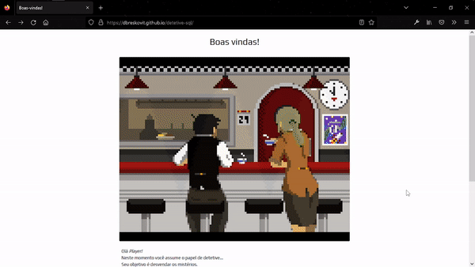

<p align="center">
  
</p>

<h1 align="center">Fork from: Detetive SQL</h1>
<p align="center">Help the detective to solve the cases using the SQL programming language</p>

<h3 align="center">
  
 <!-- License -->
  <a href="./LICENSE" target="_blank">
    
  </a>

 <!-- Twitter Author-->
  <a href="https://twitter.com/uianes" target="_blank">
    
  </a>

 <!-- Forks -->
 

</h3>

<br />

# 🧪 Technologies

- [HTML5](https://developer.mozilla.org/pt-BR/docs/Web/HTML)
- [CSS3](https://developer.mozilla.org/pt-BR/docs/Web/CSS)
- [Javascript](https://developer.mozilla.org/pt-BR/docs/Web/JavaScript)

<br>



# 🚀 Getting started

Clone the project and access the folder.

```bash
$ git clone https://github.com/dbreskovit/detetive-sql
$ cd detetive-sql
```

OR:

```bash
# Access the project online
$ start https://dbreskovit.github.io/detetive-sql/
```

# 🦄 Authors

<table>
  <tr>
    <td align="center">
      <a href="https://github.com/Uianes" style="text-decoration: none;color: #9644CD;">
              
            <br>
        <sub>
          <b>Uianes</b>
        </sub>
      </a>
    </td>
    <td align="center">
      <a href="https://github.com/dbreskovit" style="text-decoration: none;color: #9644CD;">
              
            <br>
        <sub>
          <b>Diego</b>
        </sub>
      </a>
    </td>
  </tr>
</table>

#

<p align="center">
    <sub>Copyright © 2022 - dbreskovit</sub><br>
    <sub>Made with 💜 by <a href="https://github.com/dbreskovit" style="text-decoration: none;color: #9644CD;">dbreskovit</sub></a>
</p>
